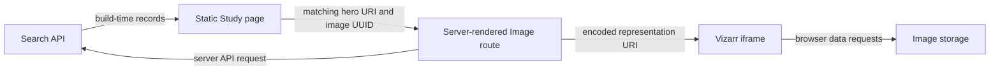

# BioImage Archive frontend architecture

The frontend uses Astro pages and layouts, shared JavaScript API helpers, static collection data, and browser-side table/search behavior. Some pages are generated using APIs during a build; others fetch data when the server handles a request. Testing only browser requests leaves the build and server boundaries untested.

This map is grounded in application baseline `808857d90a142ab0dc10c873ec44a2e24a344a76`. The fork's initial engineering changes preserve those application files.

## Source ownership boundaries

| Surface | Actual source | Responsibility |
| --- | --- | --- |
| Routing | [src/pages](../src/pages) | Study, Image, browse, gallery, help, policy, project, and landing pages |
| Page shells | [src/layouts](../src/layouts) | BioImage Archive/EMPIAR layout, navigation, external styles/scripts, and analytics integration |
| Shared data access | [SharedJSFunctions.js](../src/components/SharedJSFunctions.js) | API requests, pagination, identifiers, formatting, and viewer URL construction |
| Search response rendering | [Search.astro](../src/components/search/Search.astro) | Server-side search API requests and result controls |
| Search navigation | [search-results.js](../src/components/search/search-results.js) | Browser history, cursor navigation, fetched HTML, and current-navigation ownership |
| Image-table requests | [ViewableImageTable.js](../src/components/ViewableImageTable.js) | Browser-side DataTables state and API calls |
| Collection selection | [src/data/collections](../src/data/collections) | Curated gallery selection and checked-in metadata |
| Content collections | [src/content/config.ts](../src/content/config.ts) | Case-study, news, announcement, and contributor schemas |
| Public resources | [public](../public) and [src/assets](../src/assets) | Public paths and imported assets with different build handling |
| Adapter/configuration | [astro.config.mjs](../astro.config.mjs) | Base prefix, output, redirects, public environment fields, and adapter selection |
| Operations | [Dockerfile](../Dockerfile), [helm-chart](../helm-chart), [netlify.toml](../netlify.toml) | Container startup, chart interfaces, and Netlify build/redirect configuration |

These boundaries explain where existing behavior lives. They are not a proposal to relocate every component or replace jQuery/DataTables.

## A Study to Image journey

[The Study route](../src/pages/study/[accessionID].astro) obtains accession IDs through `getAllStudiesFromAPI`, then builds each selected Study from API data. Its hero link matches the selected example URI against image metadata named `image_static_display_uri` and links to the matching image UUID.

[The standard Image route](../src/pages/image/[uuid].astro) explicitly disables prerendering. It fetches the image and related Study on the server, selects a recommended representation or an OME-Zarr fallback, and constructs a Vizarr URL. The iframe delegates `loopback-network` and `local-network-access` to support local viewing. Gallery-specific Image routes are separate consumers and require their own characterization.

`getPublicVisualisationURI` rewrites the known internal Living Objects host to its public equivalent. `buildVizarrViewerURL` encodes the source with `URL.searchParams`. A correct iframe URL or loaded frame is not evidence of successful OME-Zarr decoding.

## Server and browser request distinction

[Search.astro](../src/components/search/Search.astro) fetches browse results before returning the page. [search-results.js](../src/components/search/search-results.js) subsequently fetches the page's HTML during client navigation and replaces the search shell. Mocking only the browser's outbound search API requests does not cover the server's API request.

Static AI-ready and spatialomics Study pages also query APIs during generation. [The spatialomics Study route](../src/pages/galleries/spatialomics/study/[accessionID].astro) uses `PUBLIC_MONGO_API` for dataset file references. Some browser table components also contain direct development API URLs. A deterministic fixture suite must cover these actual boundaries rather than assume one configurable endpoint covers all calls.

## Build and deployment interfaces

| Mode | Existing entry point | Preserved interface |
| --- | --- | --- |
| Node | `npm run build` then `npm run prod` | `dist/bioimage-archive/server/entry.mjs`; production command sets port 8080 and host `0.0.0.0` |
| Netlify | Netlify's configured `npm run astro build` | Separate Netlify adapter artifacts and generated redirects; direct build differs from the package's check/copy command |
| Docker | `npm run build && npm run prod` at startup | Build occurs after container environment injection; image currently uses `node:lts-alpine` and `npm install` |
| Helm | Existing deployment/service templates | Fixed upstream image namespace, port 8080, base-prefixed readiness path, and public API/analytics values |

The adapter chooses Netlify when `NETLIFY` or `NETLIFY_DEV` equals `true`, or when `AWS_LAMBDA_FUNCTION_NAME` is nonempty. Otherwise it selects the standalone Node adapter. Keep adapter outputs isolated during validation.

The public prefix remains `/bioimage-archive`. The npm production build copies `public/robots.txt` and `public/redirect_index.html` into the root `dist/`. These are artifact contracts; their existence alone does not prove a particular host serves the root URL as intended.

[The route and configuration reference](reference/routes-and-configuration.md) inventories all page files and configured legacy redirects. It distinguishes known valid examples from absent or malformed cases whose response behavior remains unverified.

The schema defines `PUBLIC_SEARCH_API`, `PUBLIC_MONGO_API`, `PUBLIC_GTAG`, and `PUBLIC_WEBSITE_STATE`. Their actual defaults are in the configuration. Do not assume a public-prefixed value is a secret or that an already-built client value can change at server startup. Docker's current startup build and a prebuilt deployment have different configuration timing; migration needs explicit proof.

## Preservation and test priorities

| Boundary to preserve | Plausible regression | Required evidence before changing it | Review responsibility to confirm |
| --- | --- | --- | --- |
| Base, route families, redirects, and root assets | A link loses the prefix or a legacy redirect points to a missing route | Source-derived route manifest, built artifact checks, valid/unknown/malformed route cases | Frontend maintainer |
| Search query, filters, sorting, pagination, and history | Navigation drops a facet or an old response replaces the current results | Deterministic API/server/browser journeys with Unicode and reserved inputs | Frontend/API maintainer |
| Identifiers, counts, units, and relationships | Missing becomes zero, or an image links to the wrong Study | Fixture assertions against the actual consumed fields | Data/frontend maintainer |
| Hero image and representation selection | A hero points to another image, or the viewer opens the wrong representation | Source/URI assertions and real tiny OME-Zarr decoding separately | Viewer/frontend maintainer |
| File lists and downloads | Reserved filename characters alter the destination | Bounded fixture cases and current upstream-overlap review | Data/frontend maintainer |
| Public configuration, adapters, ports, chart values, and startup timing | A prebuilt image silently retains the wrong endpoint | Two-configuration checks, both adapter builds, local Docker and offline Helm checks | Deployment maintainer |
| Scientific content, assets, and attribution | A style change alters meaning or drops attribution | Content-schema/link checks and responsible human review | Content/data maintainer |

The review roles in this table are responsibilities to confirm, not newly assigned owners. Only the checks recorded in [the baseline](engineering/baseline.md) have run. Browser protection, missing-record behavior, local viewing, configuration timing, and deployment checks remain separate work.
